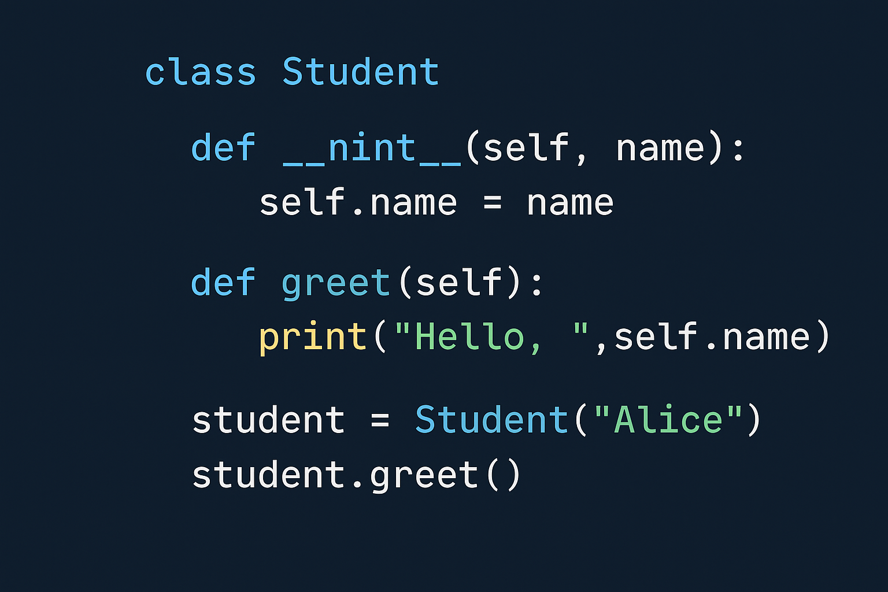

# Learning Course For Students in Python

This repository contains a Jupyter notebook (`main.ipynb`) that provides a learning course or exercises in Python for students, along with an illustrative image (`image.png`).

---

## Contents

- **main.ipynb** – An interactive notebook that covers basic (and possibly intermediate) Python concepts. It may include:
  - Fundamental syntax (variables, data types, conditionals, loops).
  - Functions and how to use them.
  - Data manipulation and useful examples for practice.
  - Step-by-step exercises or explanations.


---

## Usage

1. Clone the repository:
   ```bash
   git clone https://github.com/marius2347/Learning-Course-For-Students-in-Python.git
   cd Learning-Course-For-Students-in-Python
   ```
2. Open `main.ipynb` with Jupyter Notebook or JupyterLab:
   ```bash
   jupyter notebook main.ipynb
   ```
3. Explore the content and run the cells following the structure.
4. The image `image.png` is included for illustration.

---

## Preview Image



---

## Contact

For any questions, suggestions, or collaboration opportunities, feel free to reach out at: **mariusc0023@gmail.com**

---

Happy learning and coding!
